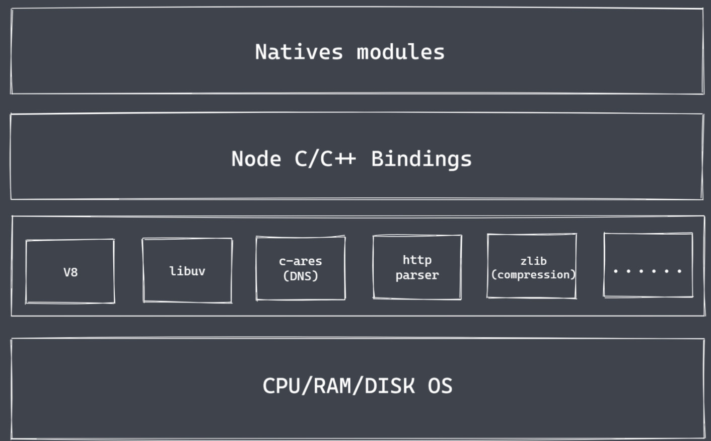

## Node.js 可以做什么？

- 实现轻量级、高性能的 Web 服务
- 前后端 JavaScript 同构开发
- 便捷高效的前端工程化，提高工作效率


- 理解 Node.js 的架构和运行过程，不仅限于记住例如 Node.js 是一个 JavaScript 的运行时。
- Node.js 异步 IO 和事件驱动


## Nodejs 架构

Natives modules

- 当前层由 JS 实现
- 提供应用程序可直接调用库，例如 fs、path、http 等（也就是我们日常所说的内置核心模块）
- **JS 语言无法直接操作底层硬件设备**（因此 nodeJS 核心模块与硬件设备之间如果想通信，还需要一个桥梁的，而 Builtin modules 就是这个桥梁，通过它就可以让 Node.js 的核心模块来获取到具体的服务支持，从而去完成更多的底层操作，例如文件的读写行为）

底层

- V8 引擎（主要的功能有 2个）：1、类似于虚拟机，主要来执行 JS 代码（自己写的 JS 代码、内置的 JS 代码、第三方的 JS 代码）；2、提供桥梁接口（简单来说就是 V8 为 Node.js 提供了初始化的操作，它创建了执行上下文的环境和作用域这些内容，有了 V8 之后，nodeJS 具备执行和调用功能的大前提）（PS：开发者在使用 Node.js 的时候，看起来在代码里面直接调用了某个 JS 函数，但是真正起效果的是由 C 或 C++ 所编写的函数，而这中间的转换和调用的具体实现，就是需要 V8 引擎来完成）
- Libuv 库：事件循环、事件队列、异步 IO
- 第三方模块：zlib、http、c-ares 等



Node.js 的核心是由 3层组成的：最上层的：内置核心模块（暴露了相应的 JS 功能接口，供开发者可以直接去进行调用）；中间：帮助我们找到对应功能的 C++ 实现的 builtin modules 层，这个过程是需要 v8 引擎来配合实现的；最下层：会有 v8 引擎，它除了去构建 Node.js 运行环境，还会负责 JS 代码的最终执行。libuv 库 可以处理具体的 Node 环境下代码执行过程中许多细节。

------

## 为什么是 Node.js

Node.js 在诞生之初是为了实现高性能的 web 服务器，后来经历了长时间的发展之后，Node.js 慢慢演化成了可用的服务端”语言“。这样就让我们 JavaScript 实现了在浏览器之外的平台去进行工作的场景。

NodeJS 是一个平台，或者说是运行时，只是对于前端来说呢，我们可以直接去使用 JS 在 node 环境下进行编程。


我们现在想要探讨的是 node 作为服务器使用的时候会有的一些相关内容，由图不难看出，在忽略掉网络带宽和硬件性能等客观条件之后，真正去影响用户获取数据速度的其实是 IO 的时间消耗。

我们都知道，IO 是计算机操作过程中最缓慢的环节，数据的读写操作。数据的读写操作，终归是有时间消耗的，假设当前是一个串行的模式，对于一个服务器来说，如果当前正在处理的请求中它包含了一个需要长时间等待的 IO 行为，那后续的任务就不能得到及时的响应了，显然这是很不友好的，而且我们当下在开发过程中去使用到的一些服务器，它也都具备了并发处理事务的能力，即在并发的实现上，传统的做法，或者其他高级编程语言实现的方式，其实就是采用多线程 或者说 多进程的方式，但是这样的解决思路在某些场景下肯定也是会有些问题的。

如果我们使用多线程来处理并发问题，那它的思路是：当我们有几个人来就餐，那我们就会去准备几个服务员来完成相应的服务，在这之后客人就去进行点菜，然后服务员就去等待点餐的结果。对应到我们程序里就是，当前有几个请求从客户端发送到服务端之后，我们服务端就会去准备几个进程或者说线程来接收这些请求，那这样的服务对用户的体验来说是非常友好的，但问题也会很明显，如果某个时间内，同时有很多人来进行就餐，而我们是不可能无限的去增加服务员的数量，那这样无人响应的问题就会出现。而分析点餐的过程之后就可以发现，其实大部分的时间消耗都来自于客人点菜的过程，此时服务员是处于空闲状态的，所以基于这种情况也就有了 Reactor 模式，也叫应答者模式，它的核心思想就是 只保留一个服务员，然后客人自己去进行点菜，当客人点餐行为结束之后，只需要去呼叫当前的服务员就可以了，这样就相当于使用了单线程 而 完成之前多线程才能实现的事情，并且它是非阻塞的，也就是说每个客人进来之后，我们都会有一个服务员能去立马给它一个响应，只不过在它点餐的过程中，我们这个服务员可能正在服务于其他客人。使用这样的操作就可以避免多个线程之间在进行上下文切换的时候，需要去考虑的一些状态保存、时间消耗等问题。而 NodeJS 也是正是基于了 reactor 模式，再结合 JS 语言本身所具备的一些单线程、事件驱动的架构和异步编程的一些特性，然后让我们这样的单线程可以远离阻塞，从而通过异步非阻塞 IO 来更好的去使用 cpu 资源，并且去实现高并发请求的处理。这样也是为什么历史上尝试着将 JS 移植到其他平台的实现方案有很多，而 NodeJS 却是最出彩的那一个。

上述内容一直在突出的是 NodeJS 在处理 IO 时所具备的优点，这也就意味着在非 IO 行为的时候，它其实也会有一些不适用的地方，比如说当前点餐的客人，它如果都不需要去花时间来思考我们要吃什么，而是立即进行点餐，那么这个时候，一个服务员显然是不够用的，对应到程序里，也就是所谓的 CPU 密集型，所以对于 NodeJS 的使用来说：

**<u>NodeJS 更适合于 IO 密集型高并发请求</u>**，而并不是大量且复杂的业务逻辑处理，但这也并不影响将 NodeJS 应用于同构开发和前端过程化中，它仍然是大前端的基石。


------


## Nodejs异步IO

假设我们当前是有两个 IO 任务，而且我们现在是一个单线程的，这个时候俩任务单独去执行的时候，分别会耗时 t1 和 t2 ，如果现在采用同步的方式来完成，那总时间 T 应该是大于 t1 和 t2 的和，因为我们 t2 的执行要等到 t1 的结果产出之后才会发生。而如果说我们现在采用的是异步的方式来执行的话，那总时间的消耗肯定是小于 t1 和 t2 的和，或者说就是 t1 和 t2 中时间较大的那个值。


所以这样看来异步 IO 的做法对于程序的执行效率来说是有帮助的，因此我们是需要它的。而异步 IO 也并非是 NodeJS 的原创，但是它在 NodeJS 中却拥有广泛的应用。


其实对于操作系统来说，IO 是只有阻塞和非阻塞两种，也就是说，当前是否能够去立即获取到调用之后所返回的结果，就像我们上文所提到的，当我们采用了非阻塞的 IO 之后，CPU 的时间片就可以被拿出来，然后去处理其他的事务。此时对于性能是有所提升的，但这种操作也同样存在一些问题，因为立即返回的并不是我们业务层真正期望得到的实际数据，而仅仅是当前的调用状态。


异步 IO 的做法对程序的执行效率是有帮助的。对于操作系统来说，IO 只有阻塞和非阻塞两种。操作系统为了获取完整的数据，会让应用程序去重复调用 IO 操作，从而来确认 IO 操作是否已经完成了，我们也将这种重复调用的操作来判断 IO 是否完成的技术，称之为轮询。常见的轮询技术：read、select、poll、kqueqe、event ports，虽然轮询技术能去确定 IO 是否完成，将获取 IO 完成之后产出的数据再返回回去，但是对于代码而言，它还是同步的效果，因为在轮询的过程中，程序仍然是在等待 IO 的结果，所以我们期望的 IO 应该是代码可以直接去发起非阻塞的调用，但是他也是无需通过遍历或者唤醒的方式来轮询判断当前的 IO 是否结束，而是在调用发起之后，去直接进行下一个任务的处理，然后等待 IO 的结果处理完成之后，再去通过某种信号或者说回调的方式将数据传回给当前的代码进行使用就可以了。

总结：

- IO 是应用程序的瓶颈所在，因为它的处理是肯定要消耗时间的，而这个时间是跟我们设备及客观的条件是有很大关系的
- 异步 IO 提高性能无，因为我们无需原地等待结果的返回，而可以去接着处理其他的任务，CPU 的利用率会变高
- IO 操作的本身在当前操作系统级别都有对应的解决，而 libuv 库就相当于对方法进行抽象的封装，做到跨平台的效果
- NodeJS 单线程配合事件驱动架构及 libuv 实现异步 IO


------


## 事件驱动架构

事件驱动的架构是软件开发中的通用模式

```js
const EventEmitter = require('events')
const myEvent = new EventEmitter()
myEvent.on('事件1', () => {
    console.log('事件1执行了')
})
myEvent.emit('事件1')
```

events 模块是内置的核心模块，已经提供好了，直接去用就行了


------


## Nodejs单线程

nodeJS 是使用 JS 实现高效可伸缩的高性能 Web 服务器，但是在我们的认知当中，常见的 web 服务都是由多线程或者说多进程来实现的，那单线程的操作是如何来支持高并发呢？以及 nodeJS 单线程是否存在一些缺点？

Nodejs 主线程是单线程，而不是说 Nodejs 只有单线程，Nodejs 平台下的 JS 代码最终都是由 V8 来执行的，而在 V8 当中是只有1个主线程来执行我们的 JS 代码，所以这也是平时说的单线程，但是在 libuv 库中存在一个线程池的。


------


## Nodejs应用场景

Nodejs 更加适合 IO 密集型的任务处理，更加适合 IO 密集型的高并发请求，不适合去处理一些大量的业务逻辑，因为计算能力并不是它的特色。


------


## Nodejs实现API服务

```bash
npm init -y
tsc --init ## 前提你已经全局安装了typescript
npm i ts-node -D
```

编写的时候直接运行 ts 脚本而不需要把 ts 转换为 js ，所以这个时候我们就需要有个能够直接来帮助我们去运行 ts 脚本的工具，因此它也是个第三方的。`npm i ts-node -D`，此时回到对应目录下，然后在终端输入：`ts-node xxx.js`代替`node xxx.js`，就OK了。

`npm i express`，因为用的是 ts，所以`npm i @types/express -D`

```ts
import express from 'express'
import { DataStore } from './data' // 这里要解构，因为那边导出的是一个类
const app = express()
app.get('/', (req, res) => {
    // res.end('123')
    res.json(DataStore.list)
})
const app = express()
app.listen(8080, () => {
    console.log('server is running')
})
```

ts 在默认导包的时候，是不支持 .json 后缀的，如果说我们想它支持的话，来到 tsconfig.json 中，新增一个配置选项就可以了，就是：`"resolveJsonModule": true`就OK了。

```ts
import list from './list.json'
export class DataStore {
    static list = list
}
```


------


## Nodejs全局对象

- 与浏览器平台的 window 不完全相同
- NodeJS 全局对象上挂载许多属性

全局对象是 JavaScript 中的特殊对象，可以在程序的任何地方被访问到，而且我们自己也无需对他去进行定义，在浏览器平台下，window 就使我们所说的全局对象，通过它我们可以直接访问到很多属性或方法。而在 nodeJS 中全局对象就是 global，global 的根本作用就是作为宿主，全局对象可以看做是全局变量的宿主。


### Nodejs常见的全局变量

- __filename：返回正在执行脚本文件的绝对路径
- __dirname：返回正在执行脚本文件所在目录（并不是一个完整的路径，就是不包含我们当前这个文件）
- timer 类函数：执行顺序与事件循环间的关系
- process：提供与当前进程互动的接口
- require：实现模块的加载
- module、exports：处理模块导出

```js
console.log(__filename)// D:\Desktop\Code\01.js
console.log(__dirname) // D:\Desktop\Code
console.log(this) // {}
// 默认情况下，this是空对象，和global并不是一样的
```

```js
console.log(this == global) // false
(function (){
    console.log(this == global)
})() // true
```

当前在 node 平台环境下，每一个 JS 文件其实都是一个独立的模块，而模块与模块之间其实都是一个，互相独立的一个空间。

默认情况下 this 是空对象, 和 global 并不是一样的但是当出现在上面函数中的时候this改变指向, 就相同了


__dirname 表示当前目录名, 常用来拼接路径__filename 表示当前文件名$PATH 为 linux 操作系统中的环境变量名process 代表当前进程.其中包含当前进程相关信息

------


## 全局变量-process-1

是个全局变量， 所以在使用的时候不需要去执行 require 操作，就可以直接在我们代码中对他进行运用。

1. 获取当前正在执行脚本的信息，例如我们当前的进程在工作的时候，对 CPU 或内存会产生一定的消耗，利用 process 所提供的一些属性或者方法就可以去得到数据，或者当前进程在工作的时候，我们本地是什么样的环境，通过 process 也可以进行获取；
2. 对当前进程来执行一些操作，比如说可以监听一个进程在执行的过程中存在的一些内置的事件，再或者我们也可以去创建一些子进程，然后去让两者进行通信，从而来完成更多的操作。

总的来说，process 在 nodejs 开发过程中是一个非常重要的全局变量。

```js
// 1. 资源：CPU 内存
const fs = require('fs') // 把内置的fs模块导进来
console.log(process.memoryUsage())

console.log(process.cpuUsage())
```


```js
// 2. 运行环境：运行目录、node环境、cpu架构、用户环境、系统平台
console.log(process.cwd())
console.log(process.version)
console.log(process.versions)
console.log(process.arch) // 64位操作系统
console.log(process.env.NODE_ENV) // undefined 因为没有进行设置
console.log(process.env.PATH)
console.log(process.env.USERPROFILE) // 本机设置的管理员目录
console.log(process.platform) //  win32
```

process.versions 为所有相关组件的版本process.env.NODE_ENV 表示生产/开发环境, 默认为undefinedprocess.argv 为命令行参数数组

```js
// 3. 运行状态：启动参数、PID、运行时间
console.log(process.argv) // node 1.js 1 2  传了参数，此时就会返回1个数组 有4个值
console.log(process.argv0)
console.log(process.pid)
```

由此知道，argv 返回一个数组，在什么都没加的情况下，里面会有两个值，第一个是 node.exe 的路径，第二个是当前文件所在的路径。后面从第三项开始，你的参数它都会以值的方式存放到它里面，要使用的话，就对数组进行操作就行了。

此外 argv 提供了一个快捷的操作，比如想快速拿到第一个值，就可以去写一个 argv0 拿到数组的第一个值，但是它只提供了 argv0，后面都没有。


## 全局变量-process-2

```js
// 4. 事件监听
// 正常来说他就会在当前脚本文件执行完成之后被触发，此时回调会执行了。
process.on('exit', (code) => {
    // code表示当前退出的状态码
    console.log('exit', + code)
})
process.on('beforeExit', () => {
    console.log('before exit' + code)
})
console.log('代码执行完了')
// 代码执行完了
// before exit 0
// exit 0


// 让我们的程序主动退出，也就是不需要其他的底层机制帮我们判断了，我们手动去把它退出了。
process.exit()
// 此时就不会走beforeExit事件。并且这段代码后面的代码，都不会被执行！！
// 即程序走到这一块 就主动退出了。
```

注意：exit 里面只能执行一些同步的代码，不能执行异步代码的。里面如果再嵌套一个延时的操作，此时那段代码不生效。因此在执行顺序上，有before的会先执行，并且before里面是可以写异步代码的，而 exit 里面只能写同步代码。


```js
// 5. 标准输出 输入 错误
// 试着重写 console.log
console.log = function () {
    process.stdout.write('--' + data + '\n')
}
console.log(11)
console.log(22)
```


------

对一个文本文件进行读取，就要使用到 fs 模块。

```js
const fs = require('fs')
// 创建一个可读流
fs.createReadStream('test.txt')
	.pipe(process.stdout)
```

可读流就可以读任意的一个类型的文件，读完之后里面可以认为是拿到了一个数据，这个数据就可以去经过一个管道把它留给别人或者流向下一个环节。此时可以通过管道把这个数据交给下一个人，下一个人就是我们刚才所介绍的 process.stdout，从字面意思就可以大概想一下，好比有个人从文本中把数据拿出来，然后通过管道去流向下一个环节，而下一个环节是谁，就是标准输出，那标准输出又在哪呢？就在现在这样的一个终端面板中，所以回到面板里面，再去执行一下这个文件。

如果没问题的话，拿到的应该是 txt 里面的内容。


```js
process.stdin.pipe(process.stdout)
```

把里面的值交给管道进行处理，然后通过管道流给 process.stdout ，通过这个字面意思就可以理解，将来在这个面板里边是可以做输入的，这个输入的东西就会被 stdin 所拿到，拿到之后内部帮我们做好了数据的转换处理，所以此时可以经过管道流出去，流出去之后交给谁了呢？交给了 stdout

这就 stdin 的简单使用。


```js
// 试着写中文（上面是可以测试数字或英文）
process.stdin.setEncoding('utf-8')
process.stdin.on('readable', () => {
    let chunk = process.stdin.read()
    if(chunk !== null) {
        process.stdout.write('data' + chunk)
    }
})
```

先去设置了个编码集，防止出现乱码，然后在输入对象里面监听了一个是否可读的事件，如果发现一直是可读的，证明里面是有东西的，有东西就把它取出来，取完以后看一下到底还能不能读到，如果可以的话，再把它写出来就可以了。此时重新在面板里面通过 node 来找到当前的文件去执行。


