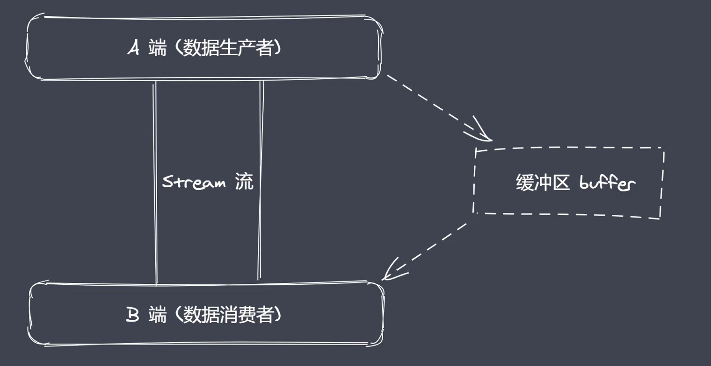
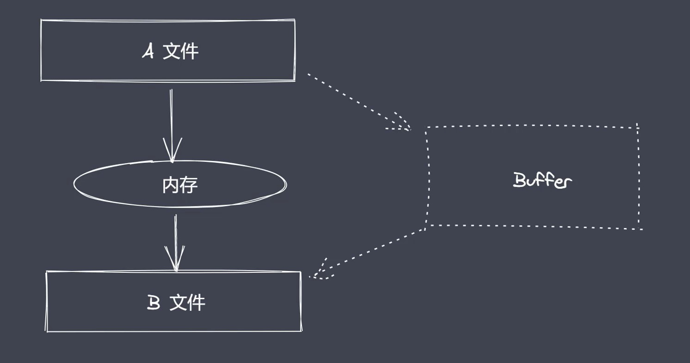
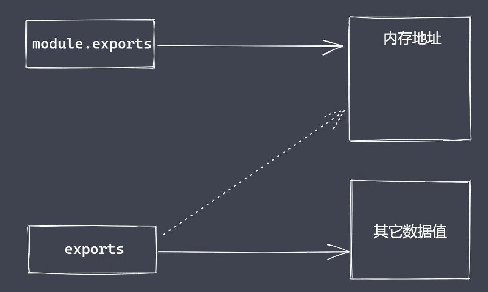

## 核心模块-path-1

path 是 nodeJS 里内置的模块，可以去使用 require 将它导入到当前的脚本中进行使用。主要作用是用来处理文件/目录的路径，比如可以使用 path 来提取某一个文件的路径或者它的后缀，再或者说可以使用 path来进行资源路径拼接等等，完成这些操作呢我们只需要去调用不同的方法就可以了，因此对于 path 模块来说，我们可以把它当做是一个工具箱，我们要做的就是掌握这个箱子里面所存放的不同工具，那对应到代码里面就是一个个具体的 API 了，为了有一个清晰的过程。

（path 模块常用 API）在写代码之前先对这些 API 进行简单的说明：

- basename() 获取路径中基础名称
- dirname() 获取路径中目录名称
- extname() 获取路径中扩展名称
- isAbsolute() 判断当前的路径是否是一个绝对路径
- join() 拼接多个路径所组成的片段，还原成一个完整可用的路径
- resolve() 返回绝对路径
- parse() 对一个路径去进行解析从而去拿到它里边的一些根路径目录名或者说后缀名信息等等，此时就可以通过 parse 来进行完成。
- format() 把路径序列化的操作
- normalize() 对一个路径进行规范化的处理（可以去把一个杂乱无章的路径，里面可能包含多个 \ 路径分隔符或者多个点这样的一些操作）


### basename()

获取路径中的基础名称

```js
const path = require('path')
console.log(__filename)

console.log(path.basename(__filename))
// 输出：1、当前被执行脚本文件的完整路径（D:\code\01.js） 2、里面最后的部分（01.js）

console.log(path.basename(__filename, '.js')) // 如果我们传了第二个参数（可选参数），它就会尝试往前面找一下，我们路径中是否包含.js的后缀，如果包含就只返回后缀前面的文件名
// 输出：01

console.log(path.basename(__filename, '.css')) // 输出一个完整带路径的文件名称，因为没有匹配到传的这个后缀
```

```js
console.log(path.basename('/a/b/c'))
// 输出：c
console.log(path.basename('/a/b/c/'))
// 输出：c
```

由此，basename 就是返回 path 路径中最后一个部分，不管这个部分是一个文件还是一个目录，都会有一个结果，且最后加不加 / 它都会忽略掉，有跟没有都一样。


### dirname()

获取路径目录名（路径）

```js
console.log(path.dirname(__filename))
// 输出：D:\code

console.log(path.dirname('/a/b/c'))
// 输出：/a/b
console.log(path.dirname('/a/b/c/'))
// 输出：/a/b
```

返回路径中最后一个部分的上一层目录所在路径


### extname()

获取路径的扩展名

```js
console.log(path.extname(__filename))
// 输出：.js
console.log(path.extname('/a/b'))
// 输出：空
console.log(path.extname('/a/b/index.html.js.css'))
// 输出：.css
console.log(path.extname('/a/b/index.html.js.'))
// 输出：.
```

1. 返回 path 路径中相应文件的后缀名
2. 如果 path 路径中存在多个 . 它匹配的是最后一个点到最后结尾的内容


## 核心模块-path-2

### parse()

解析路径

```js
const obj = path.parse('/a/b/c/index.html')
console.log(obj) // { root: '/', dir: '/a/b/c', base: 'index.html', ext: '.html', name: 'index' }
const obj = path.parse('/a/b/c')
console.log(obj) // { root: '/', dir: '/a/b', base: 'c', ext: '', name: 'c' }
const obj = path.parse('/a/b/c/')
console.log(obj) // { root: '/', dir: '/a/b', base: 'c', ext: '', name: 'c' }
const obj = path.parse('./a/b/c/')
console.log(obj) // { root: '', dir: './a/b', base: 'c', ext: '', name: 'c' }
```

1. 接收一个路径，返回一个对象，包含不同的信息
2. root dir base ext name


### format()

序列号路径

```js
const obj = path.parse('./a/b/c/')
console.log(path.format(obj)) // ./a/b\c
```


### isAbsolute()

判断当前路径是否为绝对路径

```js
console.log(path.isAbsolute('foo')) // false
console.log(path.isAbsolute('/foo')) // true
console.log(path.isAbsolute('///foo')) // true
console.log(path.isAbsolute('')) // false
console.log(path.isAbsolute('.')) // false
console.log(path.isAbsolute('../bar')) // false
```


### join()

拼接路径

```js
console.log(path.join('a/b', 'c', 'index.html')) // a\b\c\index.html （他并不是绝对路径的处理）
console.log(path.join('/a/b', 'c', 'index.html')) // \a\b\c\index.html
console.log(path.join('/a/b', 'c', '../', 'index.html')) // \a\b\index.html
console.log(path.join('/a/b', 'c', './', 'index.html')) // \a\b\c\index.html
console.log(path.join('/a/b', 'c', '', 'index.html')) // \a\b\c\index.html
console.log(path.join('')) // .   （应该是表示当前的工作目录）
```


### normalize()

规范化路径

```js
console.log(path.normalize('')) // .
console.log(path.normalize('a/b/c/d')) // a\b\c\d
console.log(path.normalize('a////b/c../d')) // a\b\c..\d
console.log(path.normalize('a//\\/b/c\\/d')) // a\b\c\d
console.log(path.normalize('a//\b/c\\/d')) // a\c\d  （b被转译了）
```


### resolve()

绝对路径

```js
console.log(path.resolve()) // D:\code （什么都不传：当前工作目录所在的绝对路径拼接进去。看上去会把工作目录拼接上！！）
console.log(path.resolve('a', 'b')) // D:\code\a\b
console.log(path.resolve('a', '/b')) // D:\b
console.log(path.resolve('/a', '/b')) // D:\b
console.log(path.resolve('/a', 'b')) // D:\a\b
```

`resolve([from], to)`：是把 to 部分拼接成一个绝对路径，如果它拼接完之后发现得到的结果并不是绝对的，那就会去帮我们当前的工作目录或者说盘符对应的路径给它加上，让他编程绝对的。而这个 from 在什么时候会去工作呢？取决于你传参的方式。

```js
// 如果这样传的话，对应到语法格式来说，他们都属于 to 部分，那它会看 a\b 它是不是一个绝对路径，很显然并不是，不是的时候它怎么办？它把我们当前 cwd 所在的目录 去把它加上去，然后变成完整的路径。
console.log(path.resolve('a', 'b')) // D:\code\a\b
// 但如果说在b前加了路径分隔符，此时a 就变成了from的部分，那它就会考虑我们当前的b跟a有没有关系，显然没有关系，此时就会返回：
console.log(path.resolve('a', '/b')) // D:\b

// 那在什么时候会有用呢？如果说把b前面/去掉，把a前面加个路径。此时第一个参数是一个绝对路径的写法，这个时候两者其实又变成有关系的了，此时结果：
console.log(path.resolve('/a', 'b')) // D:\a\b
console.log(path.resolve('/a', '/b')) // D:\b
```

如果说我们在使用 resolve 的时候传入多个参数，而我们又想让第一个参数和第二个参数之间有关系，记住，不要在第二个参数前面加上路径分隔符的操作。但正常我们在使用的时候其实情况没有那么多复杂可以去考虑的。

实际的应用过程中，见到最多的情况：

```js
// 最省心的写法
console.log(path.resolve('index.html')) // D:\code\index.html
```


总结：从语法层面上，使用的时候要考虑下是 from 和 to 这样的传参方式，理解他们是相对的关系，而这个相对的关系就取决于你第二个参数是怎么传的。在应用的过程中，其实建议就是，第一个参数省略调，让他直接走我们的 cwd ，而后面你不要去加 / 或 ./ 这些东西，让他直接是个名称，这样的话会自动的去往绝对的目录下去做拼接，这样反而是最省心的应用方式。

还有个细节是，写 ../ 的时候它会识别，是可以执行往上退的操作。


------


## 全局变量之Buffer

buffer 是 nodeJS 中除了 process 之外另外一个非常重要的全局变量，我们一般会称之为 Buffer 缓冲区，Buffer 让 JavaScript 可以操作二进制的数据操作，当前就是想通过这段内容的说明让我们不仅仅是在 API 的使用层面上掌握 buffer。

- 二进制数据
- 流操作
- Buffer

JavaScript 语言起初服务于浏览器平台而设计的， 因此在它内部其实主要操作的数据类型就是字符串，但是 nodeJS 的出现让我们在服务端也可以直接去使用 JS 进行编程，这种情况下我们就可以采用 JS 语言来完成具体的 IO 操作，例如文件的读写，网络服务中数据的传输等，而在这个过程中，我们就使用到了 buffer，可为什么 IO 操作就跟buffer 扯上关系了呢？就要从二进制数据来说起了。

用户使用软件来获取信息，而开发者使用语言来处理和展示信息，而这个信息其实就是数据，诸如我们在客户端上看到的字符、图片或者说视频还有听到的音频等等，这些数据在工作的时候又存放在客户端的哪个位置，又是以什么样的数据形态在做存储呢？例如我们当前如果想通过微信给朋友发送照片，是如何送达到朋友手机的微信呢？

**<u>IO 行为操作的就是二进制数据</u>**


Stream 流操作并非 NodeJS 独创，对于流操作来说，它本身就已经存在很多年了，就将它理解为一种数据类型，和字符串、数组是有一些相似的，也是能用于存储数据的，但是它可以分段，当我们想要去进行大数据传输的时候，就可以使用流操作，因为这样的话就可以避免由于操作的数据内存过大而出现把内存在短时间内占满的情况。当我们去采用流操作去配合管道技术，就可以将流当中的数据一段一段传给下一个端，这样一来就算是完成了大数据的传输。典型的应用场景是 我们现在看视频一般都是边下载边看的过程。数据的端到端传输会有生产者和消费者。

（流操作配合管道实现数据分段传输）


NodeJS 中 buffer 是一片内存空间，只是这个内存空间有些特殊，因为我们都知道，nodeJS 平台下的 JS 代码它最终还是由 V8 引擎来执行完成的，因此按道理来说，所有的内存消耗应该都是属于 V8 的堆内存，而这个 buffer 就是V8 之外的一片空间，对于它的大小来说是不占据 V8 堆内存的大小的，之前去使用 process 的时候也打印过内存消耗的值。

所以需要注意的是，buffer 的空间申请不是由 node 来完成的，但是在使用层面上，它的空间分配又是由我们编写的 JS 代码来去控制的，因此在空间回收的时候，它还是由 V8 的 GC 来去管理和回收，我们是无法参与到其中的工作。至于底层是如何实现这一个机制的，就不再去研究了。


总结：

- Buffer 是由 nodeJS 中的全局变量，无需 require 就可以直接去进行使用
- Buffer 让我们在 nodeJS 环境下可以直接去操作二进制数据
- Buffer 本身是一片内存空间，但是它不占据 V8 堆内存大小，直接由 C++ 层面直接去进行分配
- Buffer 的空间在使用的时候还是由 node 来进行控制，所以它的回收还是由V8 的 GC 来进行处理，无法进行人为参与
- Buffer 一般都会配合 stream 流来进行使用，充当数据的缓冲区，特别是后续在文件读写操作的时候，是离不开流操作，也就离不开 buffer




## 创建Buffer

在 buffer 中有哪些 API 是我们开发的过程中经常会使用到的，在此之前，对于 buffer来说其实就是 nodeJS 的内置类，所以这些 API 它其实就是这个类的实例方法，或者说是它的一个静态成员方法，因此在使用这些 API 之前，还需要先知道该如何去创建 buffer 实例。

创建 buffer 实例

- alloc：创建指定字节大小的 buffer
- allocUnsafe：创建指定大小的 buffer （不安全）
- from：接收数据，创建 buffer

在nodeJS 版本 v6 之前，可以直接通过 new 操作来实例化 buffer 对象，但是这种操作由于它给到我们这个对象实例的权限太大了，在后续高本版的 nodeJS 中做了一些处理，因此在这个地方其实是不建议直接对当前类进行实例化来创建 buffer 对象的，而是用上面 3种方法来创建。


### alloc & allocUnsafe

```js
const b1 = Buffer.alloc(10) // 意味着我们想要创建一个buffer的空间大小为10字节
const b2 = Buffer.allocUnsafe(10)
console.log(b1) // 所看到的格式就可以认为是buffer这种内存空间的数据类型，里面的00最终都会换算成16进制
console.log(b2)
```


### from

```js
// from 可以接收数据源，然后再去创建一个已有大小的内存空间
const b1 = Buffer.from('1')
console.log(b1) // <Buffer 31>
```

首先 from 在创建 buffer 的时候，其实是可以接收 3种数据类型，它的第一个参数就是用来放置一下到底是把什么样的数据加载到 buffer 中，从而去占据一片空间，那第一个参数能够去识别的就会有：<u>**字符串、数组、还有就是本身就是一个 buffer 类型的数据来源**</u>，比如现在放的是一个字符串。

而第二个参数就是对应的编码，如果说没有写的情况下，其实就是 utf-8 ，因为我们写入的是字符串的 1，并不是数字 1。字符编码表 ascii 码表中数值1占的编码就是1，但是现在默认走的不是 ascii 码，而是 utf-8 编码，在 utf-8 编码中，对于汉字1来说呢，它同样会存在一个指定的编码，然后这个编码会对应一个数值，这个数值再去以我们当前这种格式进行展示，会先转成 16 进制，所以这个 31 就是这样转过来的。


而在这种情况下，我们**<u>最终所得到的这个 buffer 它的长度大小就跟我所传入的数据长度是有关系的</u>**，比如此时换成汉字，因为默认情况下是 utf-8 编码，而我们的汉字在 utf-8 编码里，一个汉字刚好占据 3个字节。

```js
const b1 = Buffer.from('中')
console.log(b1) // <Buffer e4 b8 ad>
```


对于 from 来说，它还可以接收数组类型

```js
const b1 = Buffer.from([1, 2, 3])
console.log(b1) // <Buffer 01 02 03>
```

发现刚好占据3个字节，现在都是数字，所以在转成 16进制的时候，刚好就是一个数字的 1了。

```js
const b1 = Buffer.from([1, 2, '中'])
console.log(b1) // <Buffer 01 02 00>

const b1 = Buffer.from('中')
console.log(b1) // <Buffer e4 b8 ad>
console.log(b1.toString()) // 中
// 一个汉字中，如果我们想要去转成buffer的话，其实是e4 b8 ad

const b1 = Buffer.from([0xe4, 0xb8, 0xad])
console.log(b1)	 // <Buffer e4 b8 ad>
console.log(b1.toString()) // 中
```

此时发现它并没有像我想象的那样输出，所以是跟当前的编码是有关系的。对于我们传入数组的时候，其实来说如果想要去传中文的话，我们就应该先去把它转成相应的 16进制的中文数字，这个时候再往里传，那就可以去显示出来了。而像我们这样直接往里放置的时候，其实是不能够识别的。

总之我们在去用数组操作的时候，建议去使用数值，而这个数值还是建议直接使用所习惯的10进制就可以了。


from 还可以接收一个本身就是 buffer 类型然后再去创建一个 buffer

```JS
const b1 = Buffer.alloc(3)
const b2 = Buffer.from(b1)
console.log(b1)	 // <Buffer 00 00 00>
console.log(b2)	 // <Buffer 00 00 00>

b1[0] = 1
console.log(b1) // <Buffer 01 00 00>
console.log(b2) // <Buffer 00 00 00>
```

由此得出：我们在采用这种方式去创建 buffer 的时候，并不是共享空间，而是对新空间的拷贝，或者说利用老空间的大小长度去创建一个新的空间。


感觉 alloc 就是创个大小而已，里面没东西，而 from 是可以往里放东西。


------


## Buffer实例方法

- fill：使用数据填充 buffer （可以向 buffer 中填充所指定的数据，然后再去返回当前填充数据之后的 buffer）
- write：也能去向 buffer 中写入数据，但是在使用的时候它和 fill 是稍有不同
- toString：可以从 buffer 中提取数据，然后按照我们指定的编码格式去进行相应的内容展示，这个操作是很有利于我们对 buffer 内容的调试
- slice：可以从 buffer 中截取出指定长度的目标数据，这个操作和数组的截取其实是非常类似的
- indexOf：可以在 buffer 中查询指定的目标 buffer 是否是存在的，最后返回一个 布尔值来用于判断
- copy：拷贝 buffer 中的数据


### fill

核心是接收一个数据，然后把它填充到指定的 buffer 中

```js
let buf = Buffer.alloc(6)
buf.fill('123')
console.log(buf) // <Buffer 31 32 33 31 32 33>
console.log(buf.toString()) // 123123
```

当前的 fill 就是把我们所给定的数据，全都放在 buffer 里面，如果说我们给定的数据不能填满 buffer，它会反复填 填满为止。如果说给定的数据长度大于 buffer 的容器长度的话（如果是123456789的话），可以发现它最多就写满6个字节。


```js
let buf = Buffer.alloc(6)
buf.fill('123', 1)
console.log(buf) // <Buffer 00 31 32 33 31 32>
console.log(buf.toString()) // 空格2312
```

即：当前的这个1它所代表的就是从 buffer 下标哪个位置开始去执行填充操作，当前这个1 对应的其实就是位置。

```js
let buf = Buffer.alloc(6)
buf.fill('123', 1, 3)
console.log(buf) // <Buffer 00 31 32 00 00 00>
console.log(buf.toString()) // 空格12
```

由此得出：3个参数分别是 填充的数据、写入的初始位置、写入的结束位置且不包含 [a, b)


```js
let buf = Buffer.alloc(6)
buf.fill(123)
console.log(buf) // <Buffer 7b 7b 7b 7b 7b 7b>
console.log(buf.toString()) // {{{{{{
```

可以看见 buffer 里面填充的全是 7b，而 7b 是16进制的，所以转换成 10进制后对应的其实就是123，那这个数值转换到我们 utf-8 里所对应的字符就是 左大括号。


### write

```js
let buf = Buffer.alloc(6)
buf.write('123')
console.log(buf) // <Buffer 31 32 33 00 00 00>
console.log(buf.toString()) // 123
```

发现写入是默认从0位置开始，只不过和 fill 不同的是，它并没有去重复写入，当前数据源有多少个就写多少个。

```js
let buf = Buffer.alloc(6)
buf.write('123', 1, 4)
console.log(buf) // <Buffer 00 31 32 33 00 00>
console.log(buf.toString()) // 空格123
```

由此得出：第二个参数表示从 buffer 的哪个位置开始去执行写入，第三个参数表示的是向 buffer 写入的长度，如果我们设置的长度超出了数据源的长度，相当于把数据源完全写进去，前提是 buffer 容器足够放得下当前的数据源。


### toString

```js
let buf = Buffer.alloc(6)
buf= Buffer.from('你好牛啊')
console.log(buf)
console.log(buf.toString()) // 你好牛啊
```

如果没有指定位置，相当于从 buffer 的开始到 buffer 的结束，把所有内容都拉出来，通过 utf-8 的编码方式去把它直接换成习惯性看到的字符格式，所以默认值对于第一个参数来说哦就是 utf-8，

```js
let buf = Buffer.alloc(6)
buf= Buffer.from('你好牛啊')
console.log(buf)
console.log(buf.toString('utf-8', 3)) // 好牛啊   （utf8编码下一个汉字是3个字节，为了正确测试，最好给的是3或其倍数）
```

所以第二个参数表示从 buffer 里的哪一个下标开始去对应的位置去截取。

```js
let buf = Buffer.alloc(6)
buf= Buffer.from('你好牛啊')
console.log(buf)
console.log(buf.toString('utf-8', 3, 9)) // 好牛
```

简单来说就是，可以从 buffer 中提取数据，转成我们习惯看到的字符编码格式，而在使用的时候可以控制它的长度，开始位置和结束位置，而这个结束位置也是一个顾头不顾尾的用法。


### slice

```js
let buf = Buffer.alloc(6)
buf= Buffer.from('你好牛啊')
let b1 = buf.slice()
console.log(b1)
console.log(b1.toString()) // 你好牛啊  （发现默认就是从头截到尾）
```


```js
let buf = Buffer.alloc(6)
buf= Buffer.from('你好牛啊')
let b1 = buf.slice(3, 9)
console.log(b1)
console.log(b1.toString()) // 好牛 （看出来第一个参数是 从buffer哪一个位置开始截取，第二个参数是结束，也是顾头不顾尾）
```


```js
let buf = Buffer.alloc(6)
buf= Buffer.from('你好牛啊')
let b1 = buf.slice(-3) // 从后往前截取3个字节
console.log(b1)
console.log(b1.toString()) // 啊
```

总结：slice 可以传入一个指定的开始和指定的结束，但是这两个东西是顾头不顾尾，此时就会把 buffer 里面指定长度的字节进行返回。如果想执行从后往前，就传入一个负数。


### indexOf

可以传入目标 buffer，查找当前 buffer 是否存在想找的目标 buffer

```js
let buf = Buffer.alloc(6)
buf = Buffer.from('zce你好啊，爱很好，爱大家，爱所有')  // 相当于给buf重新定义赋值了 此时length为48
console.log(buf) // 很长 略
console.log(buf.indexOf('爱')) // 3 （第一次满足条件的位置）
console.log(buf.indexOf('爱'， 4)) // 15 （暂且称偏移量吧）
console.log(buf.indexOf('爱qc'， 4)) // -1 （不存在）
```

返回的是出现的位置


### copy

可以去从一个数据源把它的数据拷贝到我们的模板 buffer 里去，是一个拷贝的操作，所以需要2个buffer。

```js
let b1 = Buffer.alloc(6)
let b2 = Buffer.from('你好')
b2.copy(b1) // 可以理解为b2是拷贝源，b1相当于拷贝容器。将b2里的数据拷贝到b1里面
console.log(b1.toString()) // 你好
console.log(b2.toString()) // 你好

b2.copy(b1, 3, 3)
console.log(b1.toString()) // 你好
console.log(b2.toString()) // 你好

b2.copy(b1, 3, 3, 6)
```

第二个参数相当于从容器的第几个位置 开始执行写入。第三个参数和第四个参数分别表示 从下标为x读到下标为y的部分。

总结：b2 充当拷贝的数据源，b1 相当于是将来被拷贝容器，把 b2 拷贝给 b1。第一个参数表示从容器 buffer 的哪一个位置开始去执行写入操作，其实拷贝是 b2 里的东西写到 b1 中，所以 3 表示从 b1 的第三个位置开始执行写入。后面的3 表示从源 buffer 的哪一个位置开始去执行读取操作，而当前的 6 表示从我们当前的 源 buffer 的哪个位置读到结束，也是顾头不顾尾的操作。


------


## Buffer静态方法

- concat：将多个 buffer 通过数组的方式拼接成一个新的 buffer，便于我们去获取多个 buffer 组成数据
- isBuffer：判断当前数据是否为 buffer 类型


```js
let b1 = Buffer.from('你好')
let b2 = Buffer.from('牛啊')

// 返回拼接之后新的buffer
let b = Buffer.concat([b1, b2]) // 拼接并完整返回
console.log(b)
console.log(b.toString()) // 你好牛啊

let b = Buffer.concat([b1, b2], 9) // 指定长度
console.log(b)
console.log(b.toString()) // 你好牛
```


```js
// isBuffer
let b1 = Buffer.alloc(3)
// let b1 = '123' // false
console.log(Buffer.isBuffer(b1)) // true
```


------


## Buffer-split实现

对于 buffer 来说，在使用的时候其实在表现上有很多地方和数组类似，有下标有length属性，但是 buffer 的长度之前提到过，他是固定的，这点就和数组不一样了。一个 buffer 被创建之后，它所占据的内存空间大小其实已经固定了，我们是无法再对它进行修改了。

目前来说，buffer 原生并没有去提供专门针对于 buffer 的拆分操作，但是这个操作在业务逻辑处理的时候比较常见，因此基于 buffer 本身提供的一些方法来去实现 split 操作，进行拆分。

```js
ArrayBuffer.prototype.split = function (sep) {
  let len = Buffer.from(sep).length
  let ret = [] // 存放最终返回的结果
  let start = 0 // 默认从buffer的第一个位置开始查找
  let offset = 0 // 偏移量

  while( offset = this.indexOf(sep, start) !== -1) {
    ret.push(this.slice(start, offset))
    start = offset + len
  }
  ret.push(this.slice(start))
  return ret
}

let buf = 'zce吃馒头，吃面条，我吃所有吃'
let bufArr = buf.split('吃')
console.log(bufArr)
```


------


## 核心模块之FS

buffer 就是存储的中间变量，目的就是为了方便 cpu 在执行数据存储操作的时候，可以有一个中间的存储区域，而流操作就类似于水流一样，可以通过管道来传输数据，还可以将数据去进行分段。在 nodeJS 中，buffer 和 stream 是处处体现，而他们操作的一般又都是二进制数据，所以从这个点上说，他们和 FS 就密不可分了。

**<u>在 nodeJS 中，FS 是内置的核心模块，所有跟文件相关的操作都是通过 FS 模块来进行实现的</u>**，比如说文件以及目录的创建、删除、信息的查询或者说文件的读取、写入等，就是说，如果我们想要去操作文件系统中的二进制数据，就需要去使用到 fs 模块所提供的 API，而在这个操作过程中，buffer 和 stream 又是密不可分的。


FS 模块结构

- FS 基本操作类（当前是目录还是文件、文件的可读流可写流操作、文件的监听行为等）
- FS 常用的 API （例如文件的打开和关闭、以及文件的增删改查操作）

这里先着重看第二个部分的操作，第一个部分等到流模块再看。


权限位：用户对于文件所具备的操作权限，文件的权限操作又分为 r w x，r 代表读权限，w 写权限，x 执行权限。如果采用八进制的数字来进行表示，r 就对应 4，w 对应 2，x 对应 1，如果不具备该权限就是0。

操作系统又将用户分成 3类：1、文件的所有者，一般指当前用户自己；2、文件的所属组，类似当前用户的家人；3、其他用户，例如访客用户。


标志位 flag：代表着对文件的操作方法，例如当前是否可读可写，或者既可读又可写的行为，常见的 flag 操作符：

- r：表示可读
- w：表示可写
- s： 表示同步
- +：表示执行相反操作（r+ 可读又可写）
- x：表示排他操作
- a：表示追加操作


文件描述符 fd：当一个文件被打开的时候，操作系统就会为他分配一个数值标识，这个标识就是我们所说的文件标识符，通过这个标识符，文件操作就可以识别并追踪到某一个特定的文件。


fs 介绍总结：

- fs 是 nodeJS 中内置核心模块
- 代码层面上 fs 分为基本操作类和常用 API
- 权限位、标识符、文件操作符（文件操作会有 3个常见的概念）


------


## 文件操作API

它的任何的 API 操作都有同步和异步两种方式，例如文件的写操作就存在同步写入和异步写入两个 API ，而当前演示的是异步的 API 的操作。

- readFile：从指定的目标文件中读取相应的数据
- writeFile：向指定的目标文件中写入数据
- appendFile：追加的方式向指定文件中写入数据
- copyFile：将某个文件中的数据拷贝至另一个文件
- watchFile：实现对指定文件的监听，当内容发生修改，去执行指定的回调函数


### readFile

```js
const fs = require('fs')
const path = require('path')

// readFile 
fs.readFile(path.resolve('data1.txt'), 'utf-8', (err, data) => {
  console.log(err) 
  if (!null) {
    console.log(data)
  }
})
```

在正常的使用过程中，关于路径应该尽可能做成绝对路径，不过后面为了方便演示更多会去用相对路径。在 nodeJS 中有错误优先的概念，所以回调函数的第一个参数，如果涉及到错误的话，就应该放到第一位了，紧接着是读取到的数据。


### writeFile

往目标文件进行数据的写入

```js
const fs = require('fs')

// writeFile 
fs.writeFile('data.txt', 'hello node.js', (err) => {
	if(!err) {
        fs.writeFile('data.txt', 'utf-8', (err, data) => {
            console.log(data) // 原来的内容没有了，覆盖了
        })
    }
})
// 当我们去调用 readFile 的时候，默认就是覆盖的写入操作
```

writeFile 路径如果不存在，就会执行一个创建的操作，readFile 如果路径不存在就是会报错。

```js
const fs = require('fs')

fs.writeFile('data.txt', '123', {
  mode: 438, // 可读可写
  flag: 'w+', // 清空再去写入
  encoding: 'utf-8'	
}, (err) => {
  if (!err) {
    fs.readFile('data.txt', 'utf-8', (err, data) => {
      console.log(data) // 123lo node.js 从第一个位置开始写入
    })
  }
})
```

第三个参数就是在写入过程中 可以去设置的字符编码集、操作方式、权限位。如果目标文件存在，使用r+的时候并不会把内容清空再写入 ，而 w+ 操作就会去把当前已经存在的文件里的数据全部清空，然后再去执行写入。


### appendFile

追加写入操作

```js
const fs = require('fs')
// appendFile
fs.appendFile('data.txt', '你好', (err) => {
  console.log('写入成功') // 在尾部追加了你好
})

fs.appendFile('data.txt', 'hello node.js',{}, (err) => {
  console.log('写入成功')
})
```


### copyFile

```js
const fs = require('fs')
// copyFile
fs.copyFile('data.txt', 'test.txt', () => {
  console.log('拷贝成功')
})
```

这些操作都是一次性的操作，当前的目标文件里面假如说有一百个字节的数据，他就一次性全部拿出来放在内存里面，然后再从内存里面把它一次性再写入到另外一个文件，这些都不适合于操作大内存的文件，后续会再强调。


### watchFile

当文件内容发生修改的时候，就可以执行回调函数

```js
const fs = require('fs')
// watchFile
fs.watchFile('data.txt', {interval: 20}, (curr, prev) => {
  if (curr.mtime !== prev.mtime) { // 说明当前这个文件发生修改了
    console.log('文件被修改了')
    fs.unwatchFile('data.txt') // 取消监控文件
  }
})
```


------


## md转html实现

```js
const fs = require('fs')
const path = require('path')
const marked = require('marked')
const browserSync = require('browser-sync')

/**
 * 01 读取 md 和 css 内容
 * 02 将上述读取出来的内容替换占位符，生成一个最终需要展的 Html 字符串 
 * 03 将上述的 Html 字符写入到指定的 Html 文件中
 * 04 监听 md 文档内容的变经，然后更新 html 内容 
 * 05 使用 browser-sync 来实时显示 Html 内容
 */

let mdPath = path.join(__dirname, process.argv[2])
let cssPath = path.resolve('github.css')
let htmlPath = mdPath.replace(path.extname(mdPath), '.html')

fs.watchFile(mdPath, (curr, prev) => {
  if (curr.mtime !== prev.mtime) {
    fs.readFile(mdPath, 'utf-8', (err, data) => {
      // 将 md--》html
      let htmlStr = marked(data)
      fs.readFile(cssPath, 'utf-8', (err, data) => {
        let retHtml = temp.replace('{{content}}', htmlStr).replace('{{style}}', data)
        // 将上述的内容写入到指定的 html 文件中，用于在浏览器里进行展示
        fs.writeFile(htmlPath, retHtml, (err) => {
          console.log('html 生成成功了')
        })
      })
    })
  }
})

browserSync.init({
  browser: '',
  server: __dirname,
  watch: true,
  index: path.basename(htmlPath)
})

const temp = `
    <!DOCTYPE html>
    <html lang="en">
    <head>
        <meta charset="UTF-8">
        <title></title>
        <style>
            .markdown-body {
                box-sizing: border-box;
                min-width: 200px;
                max-width: 1000px;
                margin: 0 auto;
                padding: 45px;
            }
            @media (max-width: 750px) {
                .markdown-body {
                    padding: 15px;
                }
            }
            {{style}}
        </style>
    </head>
    <body>
        <div class="markdown-body">
            {{content}}
        </div>
    </body>
    </html>
`
```


------


## 文件打开与关闭

readFile 和 writeFile 的工作机制是将文件里的内容一次性全部读取或者写入到内存里，而这种方式对于大体积的文件来讲，显然是不合理的，因此后期需要一种可以实现边读边写，或者边写边读的操作方式，此时就应该去将文件的打开、读取、写入和关闭 看做是各自独立的环节，所以就有了 open 和 close

```js
const fs = require('fs')
const path = require('path')

// open
fs.open(path.resolve('data.txt'), 'r', (err, fd) => {
  console.log(fd) // 3 
})
// 读取完成后会有一个参数返回值，这里采用fd 也就是提到过的文件操作符。nodeJS对于这一层做了抽象，所以在不同的平台下，它都是一个数值，而我们的 0 1 2又被标准的输入输出和错误占用了，所以node里fd都是从3开始的

// close
fs.open('data.txt', 'r', (err, fd) => {
  console.log(fd)
  fs.close(fd, err => {
    console.log('关闭成功')
  })
})
```


------


## 大文件读写操作




### read 

所谓的读操作就是将数据从磁盘文件中写入到 buffer 中

```js
const fs = require('fs')

// read ： 所谓的读操作就是将数据从磁盘文件中写入到 buffer 中！！！！往缓冲区里面写数据
let buf = Buffer.alloc(10)

/**
 * fd 定位当前被打开的文件 
 * buf 用于表示当前缓冲区
 * offset 表示当前从 buf 的哪个位置开始执行写入
 * length 表示当前次写入的长度（想读取多少个字节）
 * position 表示当前从文件的哪个位置开始读取
 */
// data.txt 内容：1234567890
fs.open('data.txt', 'r', (err, rfd) => {
  console.log(rfd) // 3
    // 有了它之后就可以对他里面的数据进行处理。
    // buf 告诉他当前的缓存区是谁。readBytes 实际读了多少个字节
  fs.read(rfd, buf, 1, 4, 3, (err, readBytes, data) => {
    console.log(readBytes) // 4
    console.log(data) // 空格1234 因为offset为1
    console.log(data.toString()) // 从第三个位置开始读数据：空格4567
  })
})
```

正常来讲，缓冲区的大小是足以放得下我们想往里写的内容，否则肯定会有相应的语法报错哒！


### write

写就是读，它要去把我们缓冲区里的数据先读出来，然后再去进行写的操作。

```js
const fs = require('fs')

// read ： 所谓的读操作就是将数据从磁盘文件中写入到 buffer 中
let buf = Buffer.alloc(10)

// write 将缓冲区里的内容写入到磁盘文件中
buf = Buffer.from('1234567890')
fs.open('b.txt', 'w', (err, wfd) => { // 往b.txt里写 操作模式w 写操作
  fs.write(wfd, buf, 0, 3, 0, (err, written, buffer) => { // 首先是被操作的文件操作符，数据在buf里
    console.log(written)
    console.log(buffer)
    console.log(buffer.toString()) // 1234567890
  })
})
```

整个过程就是把缓冲区里的内容先读出来，然后通过 write 方法写入到所指定的 b.txt 文件中。


```js
const fs = require('fs')

// read ： 所谓的读操作就是将数据从磁盘文件中写入到 buffer 中
let buf = Buffer.alloc(10)

// write 将缓冲区里的内容写入到磁盘文件中
buf = Buffer.from('1234567890')
fs.open('b.txt', 'w', (err, wfd) => {
  fs.write(wfd, buf, 2, 4, 0, (err, written, buffer) => {
      // written 表示当前实际写入的字节数
    console.log(written, '----') // 4 就是上面那个写入的字节长度
    fs.close(wfd)
  })
})
```

2：表示从 buffer 里的哪个位置开始读取数据；4：参数依旧表示length 想写入的字节长度；0：表示想从文件的哪个字节开始执行写入，这个值一般是不动它的，否则编码问题可能出现乱码，而且一般都是顶行写。

最后 b.txt 的内容：3456


总结：读操作就相当于把磁盘里的内容读出来放到 buffer 中，写操作就是把 buffer 里暂存区的内容写如到磁盘文件中，有了这样两个恶行为之后，就可以去实现大文件的边读边写的操作。


------


## 文件拷贝自定义实现

虽然 nodeJS 提供了 copyFile 的 API，但这个行为是基于 readFile 和 writeFile 一次性读写操作，针对于大体积的文件来说，是不合适的，因此这里就利用 node 中已经提供的文件读写几个 API 来完成 copy 行为，方便处理大文件的读写。

略。。。。。。


------


## 目录操作API

常见目录操作 API 

- access：判断文件或目录是否具有操作权限
- stat：获取目录及文件信息
- mkdir：创建目录
- rmdir：删除目录
- readdir：读取目录中内容
- unlink：删除指定文件

略！！！


------


## 模块化历程

模块就是小而精且利用维护的代码片段，利用函数、对象、自执行函数实现分块。


常见的模块化规范

- CommonJS 规范（它是规定每个 JS 文件都是一个模块，而每个模块又都有自己的作用域，在这个作用域里面会存在变量、函数或类，这些都是私有的，外部是不能直接去使用的。然后它又提供了 exports 或 module.exports 操作去向外部选择性导出变量，如果其他的模块想要去使用这些数据，就可以使用 require 语法来进行加载。我们当前正在讨论的 nodeJS 它采用的就是 commonJS 规范。它其实是一个超集，是整个语言层面的规范，类似与 ECMAScript，模块化只是众多规范中的一种，它还可以去实现 IO 流，二进制的操作，或者 buffer 操作规范等。了有 CommonJS 规范后就可以很好的去使用 JS 在 node 平台下进行开发。不过由于 CommonJS 中模块的加载都是同步完成的，这样它其实就并不适合在浏览器端去进行使用了，因为我们在后端去运行 JS 代码的时候，模块的内容加载一般都是可以直接从磁盘中读取的，所以速度并不会受到太大影响，而这种加载机制如果是放在浏览器平台下去使用，那么肯定就会出现问题，因此后来又出现了 AMD 这种实现异步加载的模块操作规范）
- AMD 规范（在这种规范里是提供了 define 和 require 这两个关键字来实现模块化操作，最经典的代表应该是 requireJS 了，至于它在使用过程中会存在一些缺陷呢，在这就不废话了。之后又出现 CMD 规范）
- CMD 规范（它就更像站在巨人的肩膀上完成的产品，它整合了 CommonJS 与 AMD 两个规范的特点，专门用于实现浏览器平台下一步模块的加载，这种规范下最经典的代表是 CJS了）
- ES Modules 规范（它和其他的规范一样，它也能去实现模块的导入导出，提供了 import 来执行导入操作，提供了 export 执行导出操作，同时还会有一些 as、default 等语法）


模块化规范

- 模块化是前端走向工程化中的重要一环
- 早起 JavaScript 语言层面没有模块化规范
- CommonJS、AMD、CMD 都是模块化规范
- ES6 中将模块化纳入标准规范
- 当下常用规范是 CommonJS 与 ESM


------


## CommonJS规范

由于浏览器平台本身所具备的特点，例如数据一般都是通过网络来进行传输的，而且还存在着单线程阻塞的加载方式，因此这也就让 CommonJS 规范不能适用于浏览器平台，所以目前来说它主要还是应用于 NodeJS 中。CommonJS 是语言层面上的规范，而模块化只是这个规范中的一个部分。（CommonJS 规范定义模块的加载是同步完成，不能适用于浏览器平台）

- 模块引用
- 模块定义
- 模块标识


NodeJS 与 CommonJS

- 任意一个文件就是一个模块，具有独立作用域
- 使用 require 导入其他模块
- 将模块 ID 传入 require 实现目标模块定位


### module 属性

- 任意 JS 文件就是一个模块，可以直接使用 module 属性
- id：返回模块标识符，一般是一个绝对路径
- filename：得到的是当前模块的文件名称，也是一个绝对路径（返回文件模块的绝对路径）
- loaded：返回布尔值，用于表示当前模块是否完成加载
- parent：返回对象 存放调用了当前模块的模块
- children：返回数组，存放当前模块要用到（调用）的其他模块
- exports：返回当前模块需要暴露的内容
- paths：返回数组，存放不同目录下的 node_modules


module.exports 与 exports 有何区别？



它只是指向 module.exports 所对应的内存地址，因此我们就可以直接通过 exports 来导出相应的内容，但是我们是不能直接去给 exports 来重新赋值的，因为我们这样做完之后就等于是切断了 exports 和 module.exports 之间的联系，这样的话它就变成了一个局部的变量了，无法再去向外部提供数据。

exports 就是 nodeJS 它自身为了使用方便而去定义的一个变量，让他去指向了 module.exports 的空间地址，所以 也是可以通过它来进行模块的导出。不能给 exports 直接赋值，不然的话它跟 module.exports 之间的一些关系就断了


### require 属性

就是一个加载方法，至于它的加载规则就不做讨论

- 基本功能是**<u>读入并且执行一个模块文件</u>**，然后返回这个模块文件里的 exports 对象，如果说没有找到这个模块文件，就会报错
- resolve：返回传入模块文件的绝对路径
- extensions：依据不同的文件后缀名来调用不同的执行函数，最后来解析我们所传入的模块文件，如 .js .json 等
- main：返回一个对象，当前的主模块对象，可以利用它来判断当前模块是不是主模块（导别的模块 才是主模块，被导 不是）


------


## Nodejs 与 CommonJS

- 使用 module.exports 与 require 实现模块导入与导出
- module 属性及其常见信息获取
- exports 导出数据及其与 module.exports 区别
- CommonJS 规范下的模块同步加载


```js
// 一、模块的导入与导出
/* const age = 18
const addFn = (x, y) => {
  return x + y
}

module.exports = {
  age: age, 
  addFn: addFn
} */

// 二、module 
/* module.exports = 1111
console.log(module) */

// 三、exports 
// exports.name = 'zce'
/* exports = {
  name: 'syy',
  age: 18
} */

// 四、同步加载
/* let name = 'lg'
let iTime = new Date()

while(new Date() -iTime < 4000) {}

module.exports = name
console.log('m.js被加载导入了') */

/* console.log(require.main == module) */
在这里的 require.main 返回的是它的 parents，而 module 指向的是它自己

module.exports = 'lg'


```


```js
// 一、导入
/* let obj = require('./m')
console.log(obj) */

// 二、module
// let obj = require('./m')

// 三、exports
/* let obj = require('./m')
console.log(obj) */

// 四、同步加载
/* let obj = require('./m')
console.log('01.js代码执行了') */

let obj = require('./m')
console.log(require.main == module)
```


------


## 模块分类及加载流程

- 内置模块：也就是平时我们讲的核心模块
- 文件模块：第三方模块（包）或制定模块

模块的加载速度

- 核心模块：Node 源码编译时写入到二进制文件中（所以当某个 node 进程被启用时，有些核心模块就已经存在于内存中了，因此它不需要去经历整个完整的加载流程，那加载速度自然也就快一些）
- 文件模块：是在代码运行时，动态加载的（所以它需要经历整个完整的加载流程，他们的加载速度会慢一些）

由此我们发现加载的速度和加载流程是有关系的


把模块的加载流程分为 3个步骤：

- 路径分析：核心就是将当前的标识符转为绝对路径，然后找到目标模块
- 文件定位：核心是找到目标模块中的具体文件，同时确定当前文件是哪种类型，例如看当前文件是 js json 或者说其他格式，因为不同的格式，后续要采用不同的方式来编译执行
- 编译执行：按照路径去找到具体模块当中的具体文件后，再依据当前文件类型来选择对应的处理方式，最终去完成编译执行的操作，在这之后再去返回一个可用的 exports 对象


