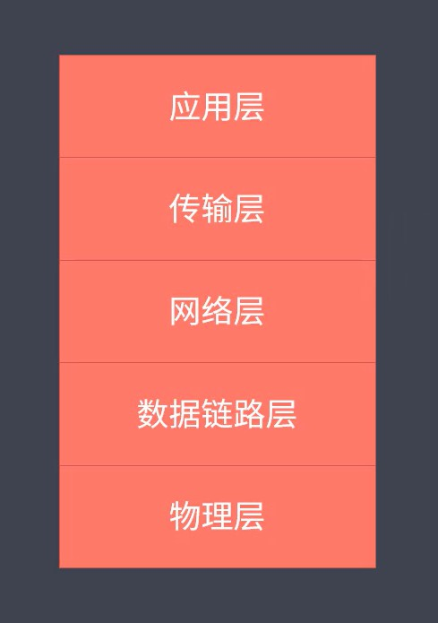

## 通信基本原理

通信的必要条件

- 主机之间需要有传输介质（例如网线、光纤、蓝牙、WiFi 等），当两台主机建立连接之后，就要去考虑数据时以什么样的形式进行传输。因为我们都知道，不论采用的是哪一种编程语言来开发，其实计算机都是不认识的，因为在计算机的世界里面，所有的数据都会被转成二进制。但即便如此，也只是解决了当前计算机识别数据的问题，而我们需要的是数据可以通过介质来进行传输。

  以网线为例，它能传输的是电信号，源源不断的高低电压，而不是 1010 这样的数字，所以这时候，每个通信的主机上就需要有网卡设备。

- 主机上必须要有网卡设备，因为网卡可以去完成信号的调制与解调制，其中把二进制的信息转为高低电压的过程就是数据的调制过程。例如现在有 A B 两台主机建立了网线的连接，想进行通信，此时 A 主机上面就会将封装好的数据来经过 A 的网卡之后进行调制，然后把它处理成电信号，有了这个电信号之后，再经过网线就传到了 B 主机上面，之后 B主机上面的网卡就可以进行解调制，拿到封装之后的数据，之后再由 B 主机它本身的通信体系来进行拆包解包，最终在某一个应用程序里面就获取到了 A 主机发送过来的数据。

- 主机之间需要协商网络速率

在 A B 主机通信之前，还有一个协商网络速率的工作，这是因为 A B 两台主机的网卡在速率上是不一样的，他们每秒传输的电信号也就不一样了。 只是需要去知道一下，在主机去进行通信之前，先要去协商一下速率就可以了。

以上是抛开了数据的封装之后，只是去考虑两台主机之间的通信的最基础的过程。

------

##  网络通讯方式

常见的通讯方式

- 交换机通讯
- 路由器通讯

我们日常所处的网络不可能只存在着两台主机，依据通讯的基础条件，我们首先要考虑的问题就是如何让我们的电脑与别的电脑去进行连接？假设现在要与另外的 10台电脑进行通讯，那我们是不可能购买一台具有 10个网卡设备的电脑的，所以这个时候我们就可以去通过交换机来完成这件事，通过交换机可以将多台电脑设备进行连接，当我们通过交换机把多台主机连接在一起之后，他们也就形成了网络，而这个网络也就是我们日常所说的局域网，假设在这个局域网内，我们的主机名称叫 A ，另外一台主机叫 B，当 A 主机想和 B 主机去进行通讯的时候，又遇到了一个问题，该如何找到这个 B（如何定位局域网中的其他主机），因为对于主机 A 来说，它是不认识其他主机的，这个操作最终会由交换机来完成，那交换机是如何确定 B 的呢？

此时就有了 mac 地址，对于任意一台主机来说，它都有一个唯一标识网卡设备的地址，也就是 Mac 地址，称之为物理地址。这样 A 主机就可以把消息发送给交换机，然后交换机去接收到这个消息之后，再通知其他所有的机器，注意这里是以广播的方式为例来说明，这个过程中其他所有的机器就都会收到这条消息，真正的 B 主机就会发现 A 想找的人是自己，而其他的主机就会将这次的消息当做垃圾丢弃，这个过程就是通过交换机来完成局域网通信的操作，这种通讯的模式就会有一些小问题，同时它也无法满足当前的互联网需求，例如说我们不可能将所有的电脑都放在一个局域网内，因为没有哪种交换机它的接口数量是无限的（交换机的接口数量有上限），而且如果我们把所有的机器放在了一个局域网里，这个时候广播风暴问题就会显得尤为明显，那任意一条消息的发送都需要被其他所有的机器去进行接收，然后再确认他是否有效。

不同的局域网之间该如何去进行通讯呢？此时就需要用到路由器来完成数据的交换了

首先我们的主机 A 要想去访问 某个服务器 B，那我们不仅需要知道 B 的网卡地址，还需要知道它在哪一个网络里，此时就要用到 IP 地址了（明确 IP 地址）。这里想要说明的是，我们的数据在发送的时候，其实它不仅仅只包含了我们程序代码所接收到的数据，还有原 Mac 地址 原 ip 地址、目标 Mac 地址以及目标 IP等等，这些内容首先会被组装成一条大的数据，之后再去发送到路由器上，然后路由器是可以识别当前要找的主机它在不在这样的一个局域网内，如果说它不在当前的局域网内，这个时候它就会按照路由表上所记录的信息去帮助我们通过网络路由来找到对应的网络，之后再去把这个数据发送过去，发送到对应的网络之后，由那边的交换机就可以完成最后的定位功能，这样就通过路由器去实现不同网络之间的主机通信。

更多的时候明确通讯的流程和一些核心的概念，例如通讯需要具备哪些条件，以及通讯是双向的，一定是有来有回，数据在传输的过程中，会与 IP 地址和 Mac 地址是包裹在一起。

------

## 网络层次模型

对于网络通讯来说，它是一个复杂的工程，他需要很多的基础硬件设备，而这些设备又有很多的厂商在进行生产，所以为了方便网络的实施、管理和维护，就会有组织来推出相应的行业标准规范，目前最常见的就是 OSI 七层模型和 TCP/IP 的四层模型。这里提到的 TCP 和 IP 它并不单指这两个协议，只是在 OSI 七层模型的基础之上，进行了一些简化，然后去形成了另外的所谓网络通信模型，但是不论现在采用的是哪一种模型，他们都是对通讯的过程进行分层，然后每层当中也都存在着很多的协议，例如我们常用的 HTTP 就属于应用层的协议，而 TCP 和 UDP 就是属于传输层的协议，下面以OSI 七层为例来介绍这些分层，以及每层主要负责的事情。

OSI 七层模型（从上到下）：

- 应用层：它是用户与网络以及应用程序与网络之间的接口，可以去利用不同的协议来完成用户请求的各种服务，例如我们可以利用 HTTP 协议来完成网站服务，利用 FTP 协议完成文件的传输服务，利用 SSH 来完成远程登录服务等等
- 表示层：这一层主要是对数据去进行转换、加密、压缩
- 会话层：控制网络连接的建立和终止
- 传输层：控制数据传输的可靠性（这一层也是一个基于端口的协议层，所以我们的数据在封装的时候还必须要去携带上目标程序所占用的端口号。例如我们在访问网站的时候总回去携带 80 端口）
- 网络层：通过路由来确定目标网络。常见的是 IP 协议，让我们可以去依据 IP 地址来确定源和目标网络
- 数据链路层：确定目标主机
- 物理层：各种网络物理设备和标准

作用就是更加清晰规范的完成网络通信，而 TCP IP 四层就是在它的基础上将前三层进行合并，统一叫应用层，然后再将数据链路和物理层合在一起叫接入层，中间的网络层就改了名字叫 主机层。这都不是我们必须要掌握的重点，只需要知道分层的目的和 7层的名称和作用，还有就是一些常见的协议名称。

最后还需要明确的是，数据从 A 主机传递到 B 主机，首先要按照分层自上向下来一层一层进行数据的封装，然后到了 B 主机的网卡协调之后，再按照自下向上的顺序进行拆解，最后在应用层里去拿到 A 主机发送过来的原始数据。

------

## 数据封装与解封装

依据网络通讯的层次模型来具体看一下被传输数据的封装与解封装的过程，首先采用的是 TCP IP 的五层划分模式。

- 在应用层产出真正要被传输的数据，这里使用 data 进行表示。
- 然后数据就传到了传输层，在这层里对于我们来说，最常见的就是 TCP 与 UDP 协议，这两个协议都是基于端口的，而这个端口的作用就是在主机上用于唯一确定一个应用进程，所以数据在这层上边就会被包裹上目标应用端口和应用在当前主机上的源端口。
- 之后数据在传向网络层。因为我们的主机它都是处于不同的网络里，所以我们需要去通过  IP 协议来确定目标主机所在的网络，因此数据在这层中会被包裹上目标主机的 IP 地址与当前主机的 源 IP，有了这些信息只能确定某一个网络，并不能确定在这个网络里面到底哪一台机器使我们想要的。
- 所以接下来数据就到达了链路层。在这层中主要是通过 Mac 地址来完成寻址操作，所以数据在这层中会被包裹上目标主机的 Mac 地址与当前主机的 Mac 地址，至此具有一条完整信息的数据就被封装完了。
- 这个时候就要传递给网络，而我们都知道，网线是不能识别这些二进制的，所以经过网卡的调制之后，就会变成高低电压，而我们这里仍然是以二进制的数据来表示我们转换之后的数据，有了这些数据后经过路由器的网络分配和传输介质的运输，最终就到达了目标主机的网卡。

（过来之后就是自下往上）这个时候它首先会去做数据的解调，将电压先变为二进制，然后再向上层去传递至链路层，此时会分析一下目标的 Mac 地址是否是当前主机的 Mac 地址，如果是就继续向上传递至网络层，在这层它就要去看一下目标的 IP 是不是当前自己的 IP ，是的话就继续拆包，向上传输至传输层，此时再去确定当前的目标端口是不是自己，是的话就再次拆解数据，向上传递至应用层，这样当前网络里的目标主机上的应用就拿到了由另外一个网络中的某主机的某一个应用所传递过来的数据，这个过程就是数据在通信过程中的封装与解封的步骤。

对于我们来说，除了知道数据的封装和解封之外，还需要了解的就是网络分层的概念，然后我们都知道 http 只是应用层中的一个最常见的协议，TCP 只是传输层中一个重要的协议，而网络通信本身是一件非常复杂的事情，但是这也并不影响我们去使用一门编程语言来完成开发，因为关于通信的事情，开发语言的本身，或者说开发框架也都已经做了封装实现，我们只需要去使用就可以了。

------

## TCP三次握手与四次挥手

需要了解的是 三次握手建立 与 四次挥手过程，而不需要去深究底层是如何实现的。

TCP 协议

- TCP 属于传输层协议
- TCP 是面向连接的协议
- TCP 用户处理实时通信

在网络分层中，他是存在于传输层里的一个协议，是直接面向网络连接的协议，一般它用于去处理实时的通信，也正是因为如此，所以它具有数据传输可靠性高的特点，但具有实时的特点之后，也就意味着，在传输效率上相对于 UDP 来说就会低一些。

报文结构（以下是完整的 TCP 协议报文应该具有的信息，而对于我们来说，只需要去了解端口和几个常见控制字段的意思就可以了）

首先端口的作用是为了标明自己和目标应用进程，而在控制字段中，SYN 为 1 的时候表示当前主机要请求建立一个连接，然后 FIN 为 1 就表示要去请求断开连接。ACK 为 1 就表示数据信息的确认。

常见的控制字段：

- SYN =1 表示请求建立连接
- FIN = 1 表示请求断开连接
- ACK = 1 表示数据信息确认

那明确了这些之后，我们就可以来看一下 3次握手的建立过程。

首先建立握手很明显是两个人的事情，所以这里就以 CS 网络架构为例，左侧表示客户端，右侧表示服务端。

第一次的时候客户端要向服务端去发送一个建立连接的请求，我们就用 SYN = 1 来进行表示，然后服务端接收到了这个请求后，就会回送一条消息表示确认接收到了客户端的请求，我们就去使用 ACK = 1 来表示，这里要说明一下，**任何一次完整的通信，都是有来有回的**，这两次请求和回送完之后就相当于是建立了一条**由客户端向服务端发送数据的通道**，注意！只是客户端向服务端。

所以服务端想要去发送消息给客户端，它还需要在发送一个请求给客户端，表示它也想去建立一个连接，我们也用 SYN = 1 来表示，同样客户端也需要去回送一个确认消息给服务端，表示接收到了这个请求，同样是使用 ACK = 1 来表示，至此就建立了一条由服务端向客户端发送数据的通道，所以这 4 次连接发生之后，我们就有了一个客户端与服务端之间的去进行数据通信的 双向通道。

不过呢，这里看起来是 4次握手而不是 3 次，本身来说就应该是 4次握手，这一点我们需要知道，只不过在实际处理的时候，服务端会在回复客户端 ACK = 1的时候，同时再去发送一个 SYN = 1 ，也就是说，它会去将这 两次 握手进行合并，这样就有了最终的 3次握手

来看挥手：

当客户端与服务器的数据传输结束之后，就应该去断开连接，让服务端可以去处理其他客户端的请求，首先客户端会去发送一个断开连接的请求给服务端，然后服务端会回送一个消息确认，此时就相当于是断开了客户端到服务端的数据通道。接着服务端会发送一个断开连接的请求给客户端，再然后客户端收到之后也会回送一个确认消息给服务端，这样的话就断开了服务端到客户端的数据通道，所以这个过程就有了 4次挥手。

到了这里会想，为什么不将服务端回送去的消息给客户端的请求 和 服务端请求与客户端断开连接请求去进行合并呢？这样不就是 3次挥手了吗？这里要明确的是，4次挥手肯定是合理的。

因为一个服务端要服务于多个客户端，我们不能保证某一个客户端将请求发送给服务端之后，服务端就能立即将结果数据全部传输回给当前的客户端。那意思就是说，有些时候，客户端的确已经把所有的数据都发给了服务端了，但是，服务端还没有将客户端想要的数据都全部传回，所以在断开连接的时候，是要分开处理的，因此挥手必须要有 4 次，而握手就可以合并为 3次。

（所以你把客户端向服务端发送数据的通道 断开不能 马上把 服务端向客户端的数据通道也断开！！所以不能合并，要分开，因此4次挥手）。数据通道。

总结：

- TCP 处于传输层，基于端口，面向连接
- 在通信之前，两台主机需要先去通过握手来建立一个双向的数据通道，我们这里主要是基于 TCP 连接来说明的（主机之间想要通信，需要先建立双向数据通道）
- 本质上，TCP 的握手和挥手都是 4次，只不过在断开的时候，我们不能进行合并，所以这块就是有了 3次握手和 4次挥手

------

## http 协议

